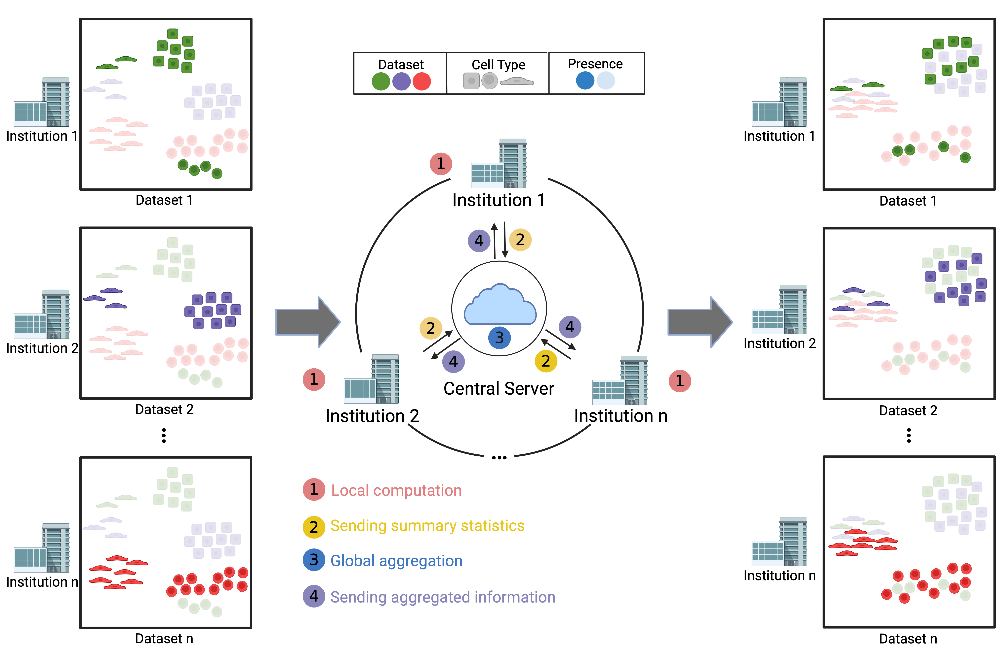

# Federated Harmony



Federated Harmony implements privacy-preserving batch-effect correction for single-cell expression matrices. The project simulates the collaboration between multiple data-holding institutions (clients) and a coordinating center to harmonise latent representations without centralising raw data.

## Key Features
- Federated implementation of Harmony-style integration with pluggable communication rounds.
- Federated k-means utilities and PCA helpers tailored for horizontal data partitioning.
- Reproducible PBMC tutorial notebook that demonstrates the full pipeline end-to-end.
- Installable Python package (`federated-harmony`) with backwards-compatible shims for legacy imports.

## Repository Layout
```
Federated-Harmony/
├── data/                      # Example PBMC datasets used in the notebook
├── docs/
│   └── figures/               # Project figures referenced in the documentation
├── notebooks/
│   └── FedHarmony_PBMC_Example.ipynb
├── src/
│   └── federated_harmony/
│       ├── __init__.py
│       ├── fl_harmony.py      # Center/client logic and harmonisation loop
│       ├── fl_kmeans.py       # Federated k-means primitives and utilities
│       └── fedpca/            # PCA helpers shared across clients and center
├── FLharmony.py               # Compatibility shim (imports from src/)
├── FLKmeans.py                # Compatibility shim (imports from src/)
├── pyproject.toml             # Packaging metadata for pip installation
└── README.md
```

## Installation
1. Create and activate a Python 3.9+ environment.
2. From the repository root run:
   ```bash
   pip install -e .
   ```
   This puts the `federated_harmony` package (located under `src/`) on your `PYTHONPATH` and installs the required dependencies (`numpy`, `pandas`, `scipy`, `scikit-learn`).

If you prefer not to install the package, set `PYTHONPATH=$PWD/src` before launching Python so that imports resolve correctly.

## Quickstart (Programmatic)
```python
import pandas as pd
from federated_harmony.fl_harmony import Client, Center, FL_harmonize
from federated_harmony.fl_kmeans import kfed

# Load the PBMC toy dataset
Z = pd.read_csv('data/PBMC_ZS.csv', index_col=0).to_numpy()
batches = pd.read_csv('data/PBMC_ZS_batch.csv', index_col=0).iloc[:, 0]

# Partition columns by batch to simulate clients
client_ids = batches.unique()
client_list = []
for client_id in client_ids:
    mask = batches == client_id
    client = Client(Z[:, mask.values], client_id=str(client_id))
    client_list.append(client)

# Initialise the global center with k-means centroids
Y, centroids, _ = kfed(client_list, n_clusters=20)
center = Center(Y, client_list)

# Run the federated harmonisation rounds
FL_harmonize(client_list, center, iter_harmony=20, max_iter_kmeans=20)
```

## Notebook Tutorial
The notebook at `notebooks/FedHarmony_PBMC_Example.ipynb` reproduces the original PBMC example. After installing the package, launch Jupyter from the repository root:
```bash
jupyter notebook notebooks/FedHarmony_PBMC_Example.ipynb
```
The notebook now imports directly from `federated_harmony` and reads data from `../data/` relative to its location.

## Data
The `data/` directory contains z-scored PBMC matrices and batch annotations used by the example notebook. Replace these files with your own single-cell datasets following the same formatting to rerun the simulation with different cohorts.

## Development
- Format/linters: none enforced yet; adhere to PEP 8 where practical.
- Tests: not provided. Consider adding unit tests for client updates and convergence checks as you extend the package.
- Legacy compatibility: top-level `FLharmony.py`, `FLKmeans.py`, and `FedPCA/` namespace re-export the reorganised package to minimise breaking changes.

## License
This project is released under the MIT License (see `LICENSE`).
